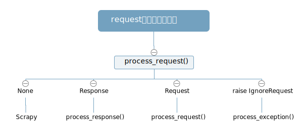
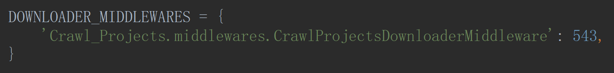
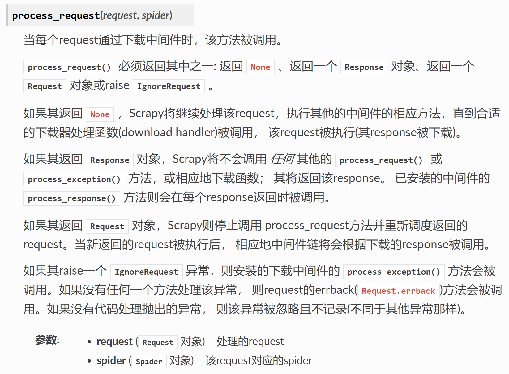
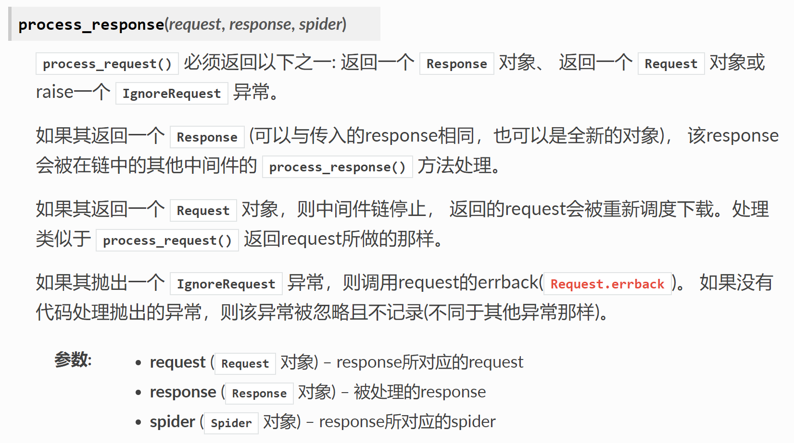
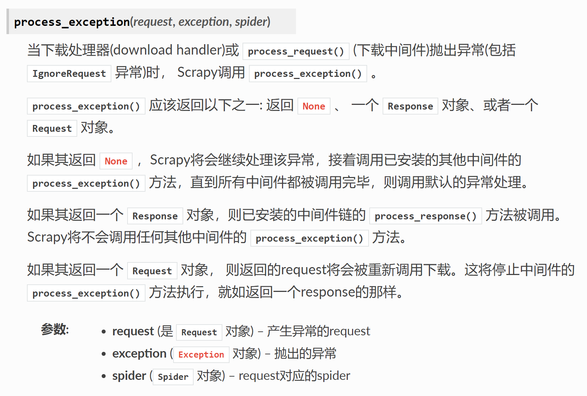

# Downloader Middlewares

下载器中间件是介于Scrapy的 request/response 处理的钩子框架。 是用于全局修改 Scrapy request 和 response 的一个轻量、底层的系统。

- 激活——不覆盖，有优先级。

- `process_request(request, spider)`——请求

- `process_response(request, response, spider)`——响应

- `process_exception(request, exception, spider)`——异常

<ol>
	<li><a href='随机请求头'>随机请求头</a></li>
    <li><a href='IP代理池'>IP代理池</a></li>
</ol>

