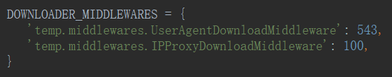

# IP代理池

- middlewares——`request.meta['proxy'] = 'http://' + proxy`

  

```python
import random


class IPProxyDownloadMiddleware:
    PROXIES = [
        '178.44.170.152:48182',
        '60.167.20.253:20701',
        '111.177.164.37:37485',
    ]

    def process_request(self, request, spider):
        proxy = random.choice(self.PROXIES)
        if request.url.startswith('http://'):
            request.meta['proxy'] = 'http://' + proxy
        elif request.url.startswith('https://'):
            request.meta['proxy'] = 'https://' + proxy
```

- settings



- spider


| IP 类型      | 透明 | 匿名 | 高密 |
| ------------ | ---- | ---- | ---- |
| 得知使用代理 | √    | √    | ×    |
| 得知真实 IP  | √    | ×    | ×    |

