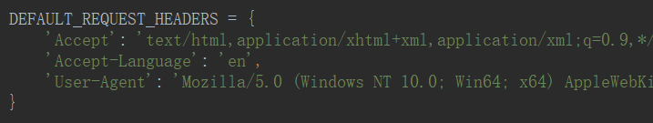
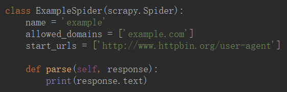
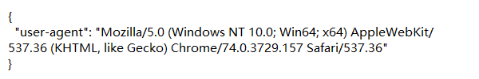
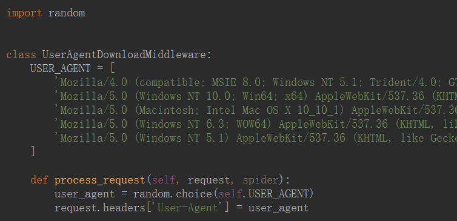
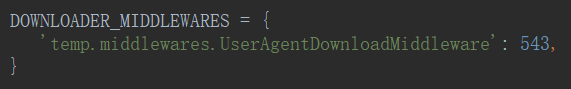

# 随机请求头

- settings



- spider





- middlewares



```python
import random


class UserAgentDownloadMiddleware:
    USER_AGENT = [
        'Mozilla/5.0 (Macintosh; Intel Mac OS X 10_9_3) AppleWebKit/537.75.14 (KHTML, like Gecko) Version/7.0.3 Safari/7046A194A',
        'Mozilla/5.0 (Windows NT 10.0; Win64; x64) AppleWebKit/537.36 (KHTML, like Gecko) Chrome/70.0.3538.77 Safari/537.36',
        'Opera/9.80 (Macintosh; Intel Mac OS X 10.14.1) Presto/2.12.388 Version/12.16',
        'Mozilla/5.0 (Windows NT 6.0; rv:2.0) Gecko/20100101 Firefox/4.0 Opera 12.14',
        'Mozilla/4.0 (compatible; MSIE 8.0; Windows NT 6.1; Trident/4.0; Avant Browser; SLCC2; .NET CLR 2.0.50727; .NET CLR 3.5.30729; .NET CLR 3.0.30729; Media Center PC 6.0)',
    ]

    def process_request(self, request, spider):
        user_agent = random.choice(self.USER_AGENT)
        request.headers['User-Agent'] = user_agent
```

- settings



<ul>
    <li><a href='http://useragentstring.com/pages/useragentstring.php?typ=Browser'>useragnet</a></li>
</ul>

