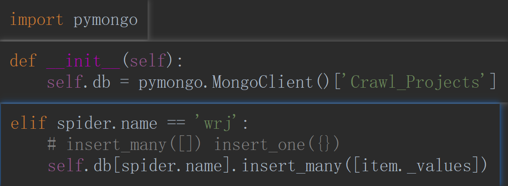
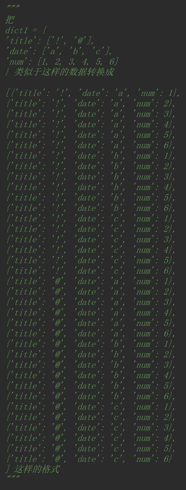

# Pymongo




- insert_many([])

用 ItemLoder 同时用 insert_many([]) 的格式转换 



```python
from copy import copy
def format_insert_many(d):
    dict_list = []
    """
    先转成这样便于循环
    [[{'title': '!'}, {'title': '@'}], 
    [{'date': 'a'}, {'date': 'b'}, {'date': 'c'}], 
    [{'num': 1}, {'num': 2}, {'num': 3}, {'num': 4}, {'num': 5}, {'num': 6}]]
    """
    for k in d:
        dict_list.append([{k: v} for v in d[k]])

    if len(dict_list) >= 2:
        # 循环次数，比列表长度少一次。
        for i in range(len(dict_list[:]) - 1):
            dict_list1 = []
            for ii_0 in dict_list[0]:
                for ii_1 in dict_list[1]:
                    # 只去前两项，进行 update 操作
                    ii_0.update(ii_1)
                    # 存入列表时 copy 因为 字典不可 hash
                    dict_list1.append(copy(ii_0))
            dict_list[:2] = [dict_list1]
    return dict_list[0]

```


-   insert_one({})

<ol>
    <li><a href='安装&配置服务'>Mongo 安装&配置服务</a></li>
</ol>

