# Get

## status_code——状态码

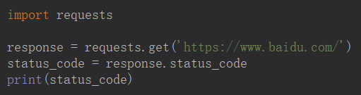

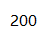

<table>
    <tr>
    	<td>1**</td>
        <td>信息，服务器收到请求，需要请求者继续执行操作</td>
    </tr>
    <tr>
    	<td>2**</td>
        <td>成功，操作被成功接收并处理</td>
    </tr>
    <tr>
    	<td>3**</td>
        <td>重定向，需要进一步的操作以完成请求</td>
    </tr>
    <tr>
    	<td>4**</td>
        <td>客户端错误，请求包含语法错误或无法完成请求</td>
    </tr>
    <tr>
    	<td>5**</td>
        <td>服务器错误，服务器在处理请求的过程中发生了错误</td>
    </tr>
</table>

## 响应头

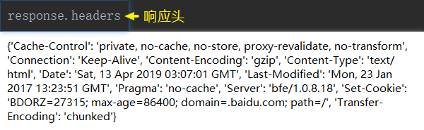

## 请求头

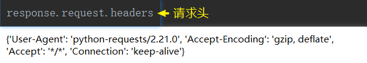

### 由于 默认的 User-Agent 和普通的浏览器不一样，所以要模拟一个 User-Agent 的请求头

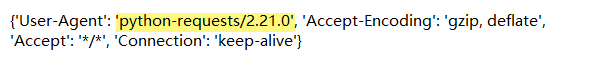

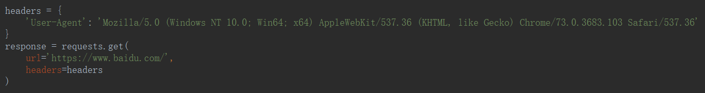

### 带参数请求

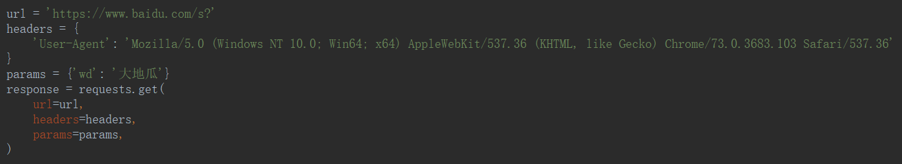

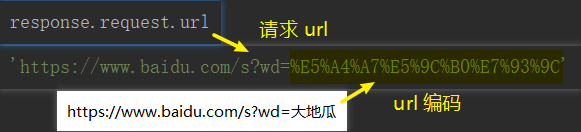

## response.text diff response.content.decode()

<table>
    <tr>
    	<td colspan='2'>都是为了获取响应的html页面</td>
    </tr>
    <tr>
    	<td>response.text</td>
        <td>type: str</td>
    </tr>
    <tr>
    	<td>response.content.decode('utf8')</td>
        <td>type: bytes</td>
    </tr>
</table>
## Proxies

`http://www.httpbin.org/ip`

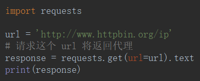

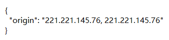

# cookiejar 和 dict

## cookiejar → dict

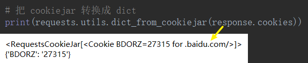

## dict → cookiejar

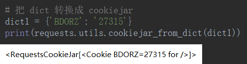

# 请求 SSL 证书错误验证

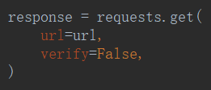

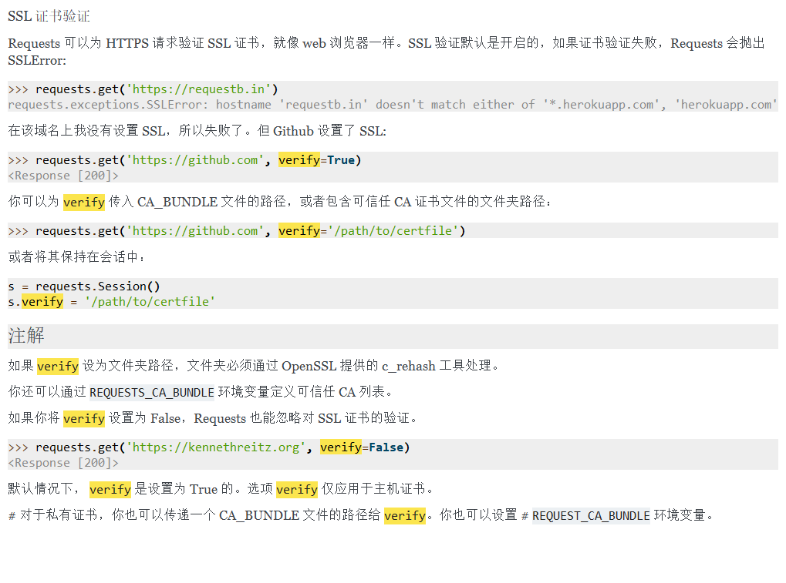

# 设置超时参数

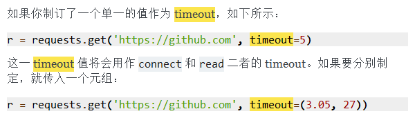

