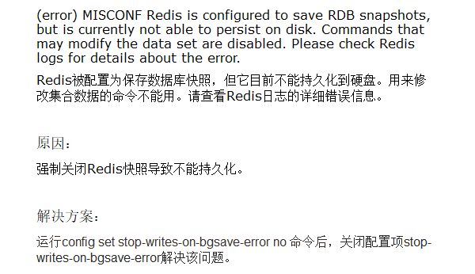
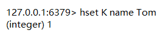
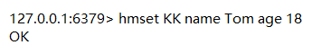
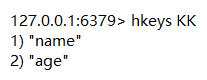
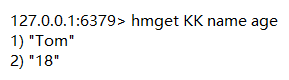
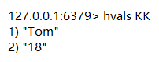
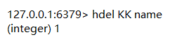

# Hash

> 存储对象

## 报错

`config set stop-writes-on-bgsave-error no`

## 增

- `hset 【K】 【F】 【V】`——设置属性和值

- `hmset key 【F1】 【V1】 【F2】 【V2】 `——设置多个属性多个值

## 查

- `hkeys 【K】`——获取指定键的所有属性

- `hget 【K】 【F】`——获取一个属性的值

- `hmget 【K1】 【F1】 【K2】 【F2】`——获取多个属性的值

- `hvals 【K】`——获取所有属性的值

## 删

- `hdel 【K】 【F】`——删除某个属性

