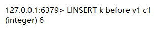

# List

## 增

- `lpush 【K】 【V1】 【V2】 【V3】`——左侧插入数据

- `rpush 【K】 【V1】 【V2】 【V3】`——右侧插入数据

- `linsert 【K】 【before|after】 【plvot】 【V】 `——指定元素之前或之后插入新数据

- `lset 【K】 index 【V】`——设置指定索引元素

## 查

- `lrange 【K】 【start】 【stop】 `——查看列表

## 删

- `lrem 【K】 【count】 【V】`
	
	- `lrem 【K】 【0】 【V】`——全部移除
	
	
	
	- `lrem 【K】 【+】 【V】`——从头往尾
	
	
	
	- `lrem 【K】 【-】 【V】`——从尾往头
	
	

