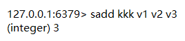
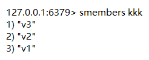
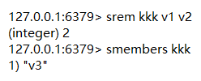
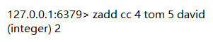
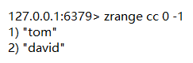
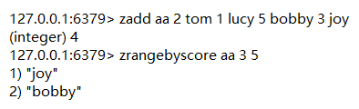
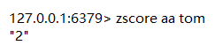
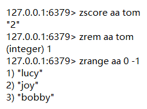
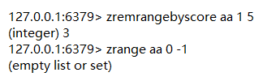

# Set

## 增

- `sadd  【K】 【member1】 【member2】`——添加元素

## 查

- `smembers 【K】`——返回所有元素（无序）

## 删

- `srem 【K】 【member1】 【member2】 `

# Zset

## 增

- `zadd  【K】 【score1】 【member1】 【score2】 【member2】`——添加元素（依照权重排序）

## 查

- `zrange 【K】 【start】 【stop】`——返回所有元素（无序）

- `zrangebyscore 【K】 【min】 【max】`——查找权重区间的元素

- `zscore 【K】 【member】`——获取权重的值

## 删

- `zrem 【K】 【member1】 【member2】`——删除指定元素

- `zremrangebyscore 【K】 【min】 【max】`——删除权重在指定范围的元素

