# String

1. 以二进制储存

2. maxlength——512M

3. redis-cli.exe——启动

4. `ping`——检查

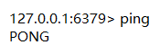

5. `select 【index】`——选库（默认为0）

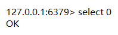

## 增

- `set 【K】 【V】`——字段

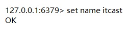

- `get 【K】`——获取对应键的值

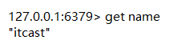

### 时效

- `setex 【K】 【S】 【V】`——设置键值及过期时间（秒）

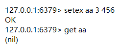

- `mset 【K1】 【V1】 【K2】 【V2】`——设置多个键值

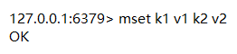

## 查

- `mget 【K1】 【K2】`——获取多个值

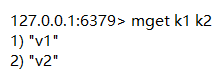

- `append 【K】 【V】`——追加值

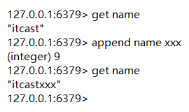

## 键命令

- `keys 【pattern】`——查看所有的键

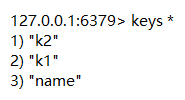

- `exist 【K】`——判断是否存在

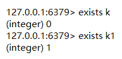

- `type 【K】`——查看键对应的值的类型

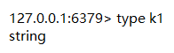

- `del 【K1】 【K2】`——删除键及对应的值

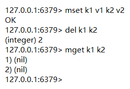

- `ttl 【K】`——查看有效时间

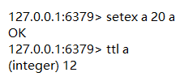

- `expire 【K】 【S】`——设置键的过期时间 *不要设置已经设定过的*

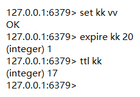

