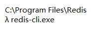
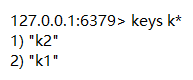

# String

1. 以二进制储存

2. maxlength——512M

3. redis-cli.exe——启动

4. `ping`——检查

5. `select 【index】`——选库（默认为0）

## 增

- `set 【K】 【V】`——字段

- `get 【K】`——获取对应键的值

### 时效

- `setex 【K】 【S】 【V】`——设置键值及过期时间（秒）

- `mset 【K1】 【V1】 【K2】 【V2】`——设置多个键值

## 查

- `mget 【K1】 【K2】`——获取多个值

- `append 【K】 【V】`——追加值

## 键命令

- `keys 【pattern】`——查看所有的键

- `exist 【K】`——判断是否存在

- `type 【K】`——查看键对应的值的类型

- `del 【K1】 【K2】`——删除键及对应的值

- `ttl 【K】`——查看有效时间

- `expire 【K】 【S】`——设置键的过期时间 *不要设置已经设定过的*

