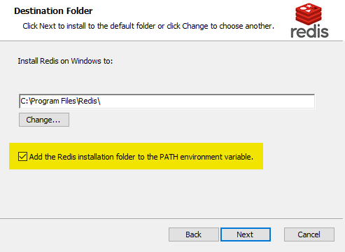
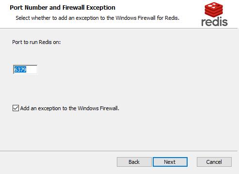
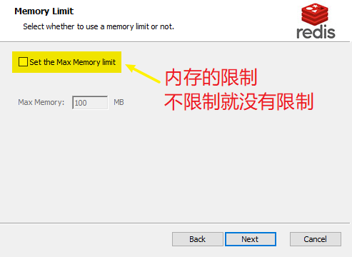
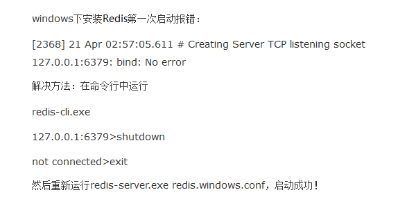
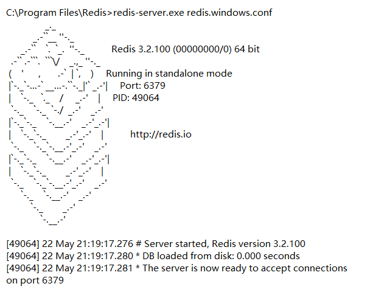
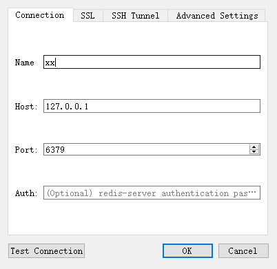
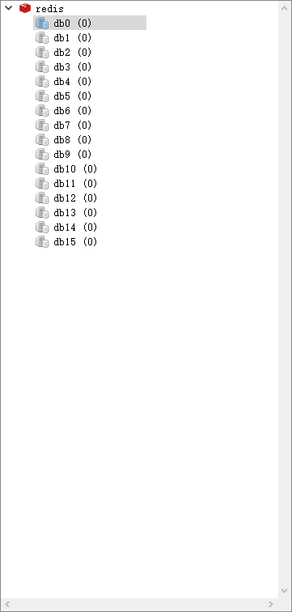

# 安装&配置服务

## Windows 下的安装&配置服务

[redis](https://github.com/microsoftarchive/redis/releases)





`6379`——默认端口号



## 启动

`redis.windows.conf`——配置文件

`redis-server.exe`——启动程序

```bash
cd C:\Program Files\Redis

redis-server.exe redis.windows.conf
```

### 如果报错




```bash
redis-cli.exe

shutdown

exit
```



## Redis Desktop Manager

[RedisDesktopManager](<https://github.com/uglide/RedisDesktopManager/releases>)





