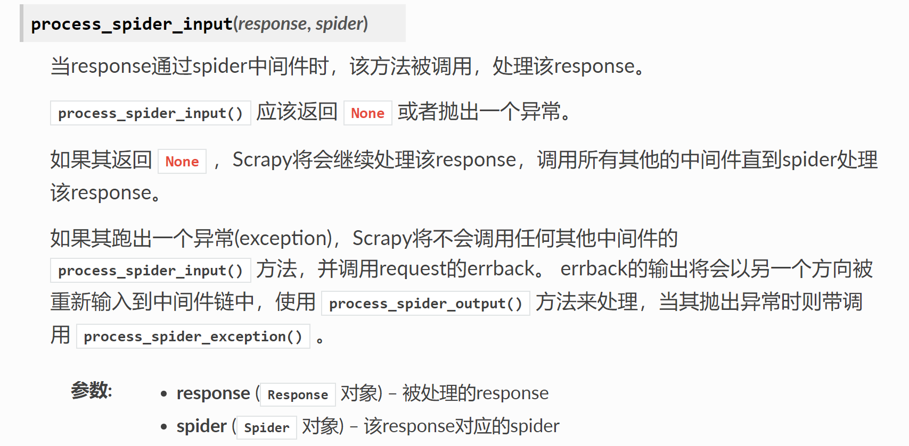
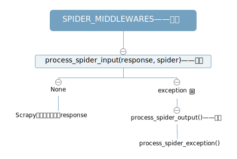
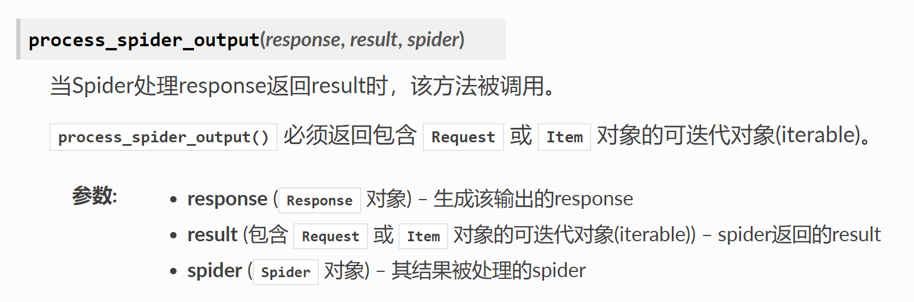
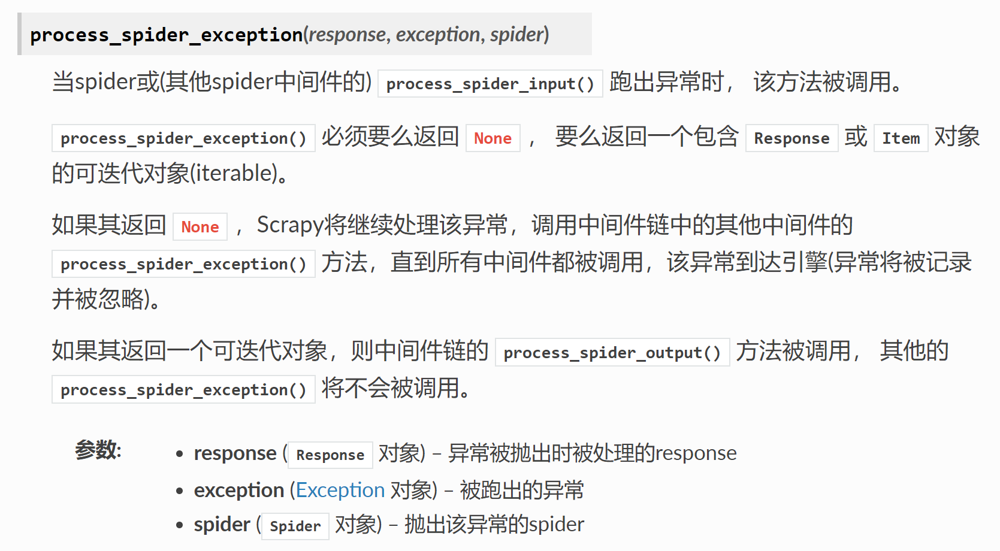
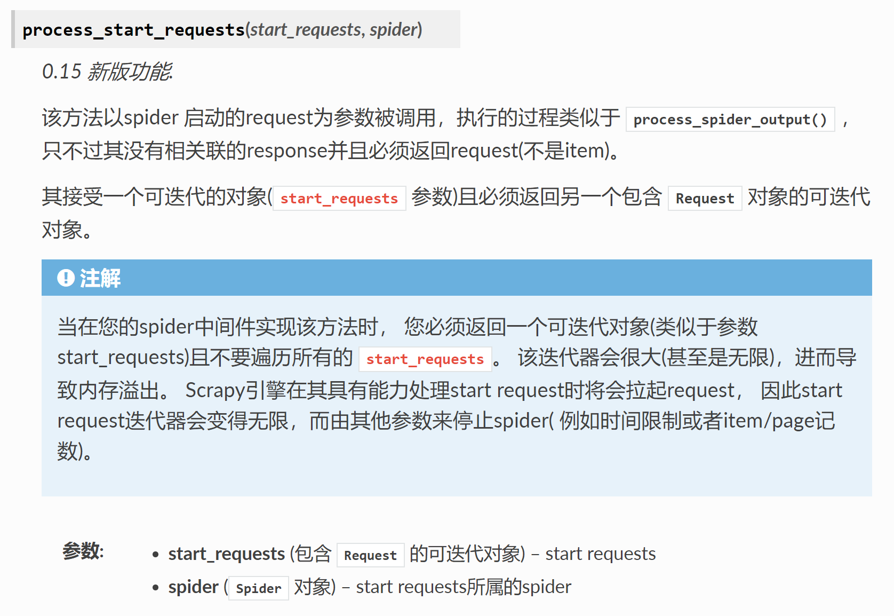

# Spider_Middlewares

- SPIDER_MIDDLEWARES——开关

SPIDER_MIDDLEWARES 设置会与 Scrapy 定义的 SPIDER_MIDDLEWARES_BASE 设置合并(但不是覆盖)， 而后根据顺序*order* 进行排序，最后得到启用中间件的有序列表: **第一个中间件是最靠近引擎的，最后一个中间件是最靠近spider的。**

- `process_spider_input(response, spider)`——当 response **通过** spider 中间件时，该方法被调用，处理该 response。

- `process_spider_output(response, result, spider)`——当Spider **处理** response 返回 result 时，该方法被调用。

- `process_spider_exception(response, exception, spider)`——跑出异常时， 该方法被调用。

- `process_start_requests(start_requests, spider)`——

