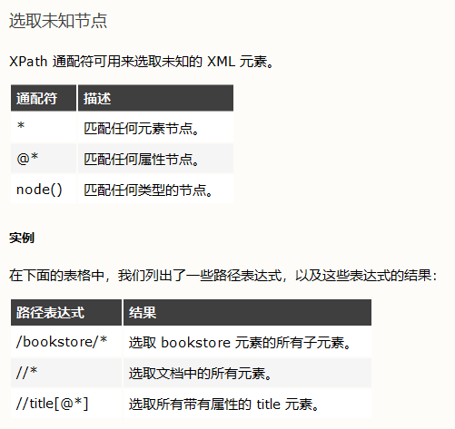

# XPath

在 XPath 中，有七种类型的节点：元素、属性、文本、命名空间、处理指令、注释以及文档（根）节点。

## 选取节点

## 谓语

## 选取未知节点

## 选取若干路径

- `//【xpath1】| //【xpath2】`——不同 xpath 拼接

## contains——模糊查找

- `//【标签】[contains(text(),"百度搜索")]`——标签的内容模糊匹配

- `//【标签】[contains(@【属性】,"百度搜索")]`——标签的属性模糊匹配

contains$_{康ten斯}$——包含

## 同胞标签

- `following-sibling::[【标签】][【序号】]`——下一个标签——`//a[@id='3']/following-sibling::*[N]`

- `preceding-sibling::[【标签】][【序号】]`——上一个标签——`//a[@id='3']/preceding-sibling::*[N]`

- sibling$_{c卜令}$——同胞

- preceding$_{泼c丁}$ ——前

## 父标签

- `..`——父标签——`//a[@id=='3']/..`

## [normalize-space()]——去除空白匹配

