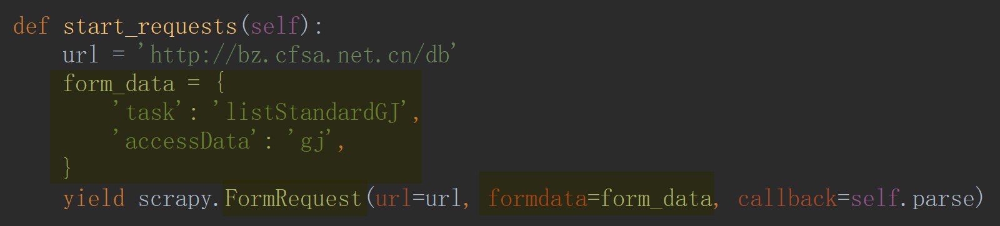
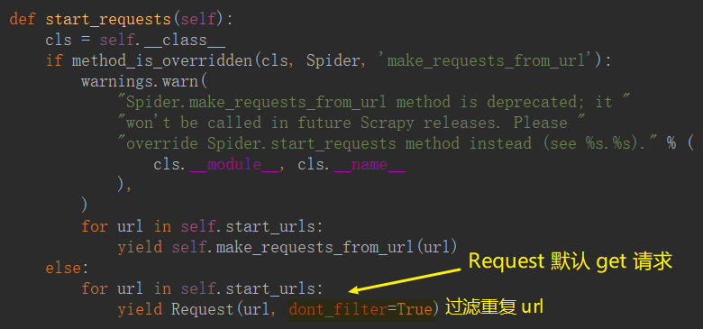
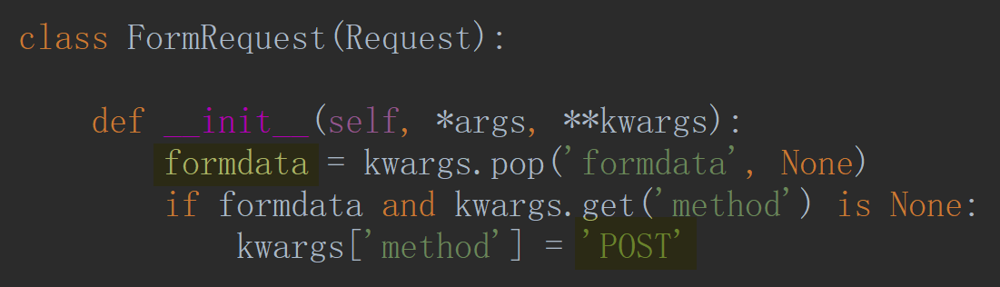

# 发送 Post 请求

有时候我们想要在请求数据的时候发送 POST 请求，那么这时候需要使用 Request 的子类 `FormRquest`来实现。如果想要在爬虫一开始的时候就发送 POST 请求，那么需要在爬虫中重写 `start_requests(self)` 方法，并且不再调用 `start_urls` 里的 url 。

- `start_requests`

- `FormRequest`

<ul>
    <li><a href='模拟登录'>模拟登录</a></li>
</ul>

