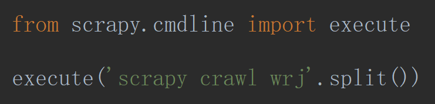
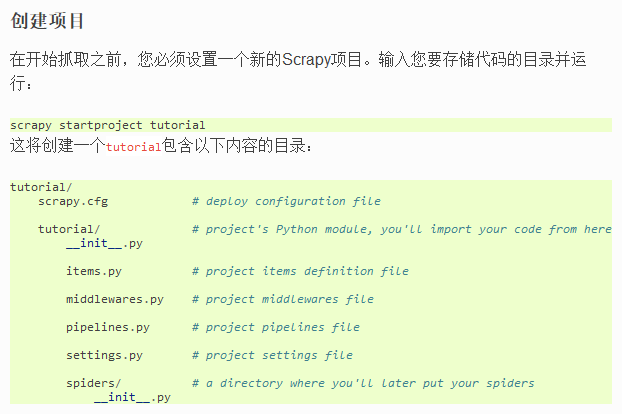
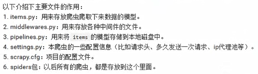
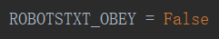
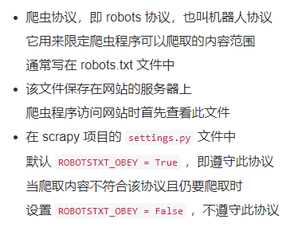

# 安装&创建&启动&配置


scheduler——类似一个队列

⑥spiders——进行信息分析 (xpath)

**Twisted**

> 同一目录下安装

<https://www.lfd.uci.edu/~gohlke/pythonlibs/>

```bash
pip install wheel

pip install Twisted-19.2.0-cp37-cp37m-win_amd64.whl

pip3 install pywin32

pip install scrapy
```

## 创建 Project

`scrapy startproject 【项目】`

`cd 【项目】`

## 创建爬虫

`scrapy genspider 【项目】 【域名】`

## 启动爬虫

`scrapy crawl 【Spider.name】`







<ol>
    <li><a href='Spiders'>Spiders</a></li>
    <li><a href='Pipelines'>Pipelines</a></li>
</ol>

## ROBOTSTXT_OBEY





