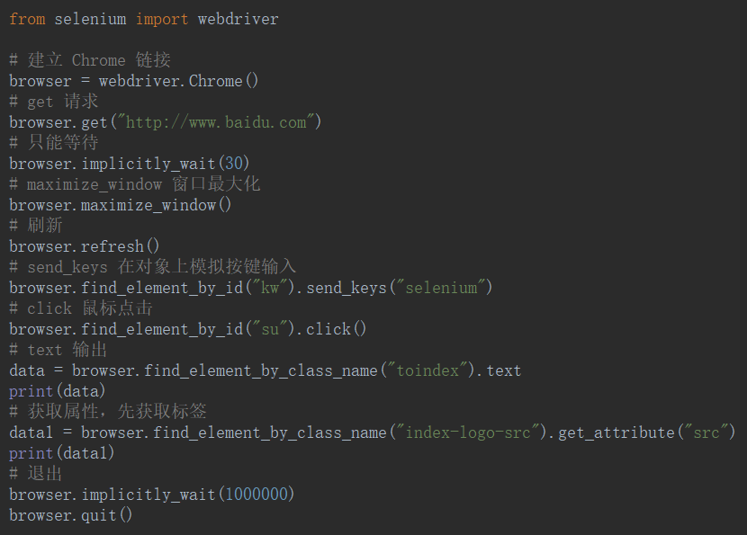

# Selenium

```python
pip install Selenium
```

selenium$_{涩咧尼耶姆}$



## 定位

- `.find_element_by_name()`

- `.find_element_by_xpath()`

- `.get_attribute()`——获取属性

## 窗口

- `.refresh()`——刷新

- `.maximize_window()`——窗口最大化

- `.back()`——退回

- `.forward()`——前进

## 鼠标

- `.drag_and_drop()`——拖动

- `.click()`——左击

- `.context_click() `——右击 

- `.click_and_hold()`——点击不松开

- `.double_click()`——双击

- `.move_to_element()`——鼠标悬停。

## 其他

- `.text`——文本输出

## 执行JS

- `.execute_script('【js】')`——执行 JS

- `.execute_script('window.scrollTo(【xpos,ypos】)')`——滚动条

	- xpos——要在窗口文档显示区左上角显示的文档的 x 坐标。
	
	- ypos——要在窗口文档显示区左上角显示的文档的 y 坐标。

## frame

- `.switch_to.frame(【id | name | WebElement(xpath)】)`——通过 id 或者 name 或者 WebElement 的 xpath，切进 frame

- `.switch_to.parent_frame()`——后退 frame

- `.switch_to.default_content()`——切回主文档

## 截图

- `.save_screenshot(【保存路径】)`——截图并保存

