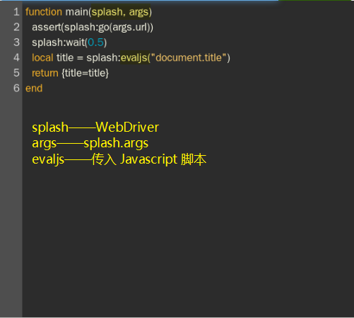
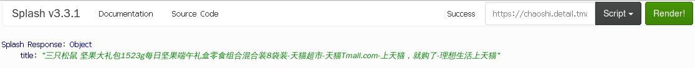

# Splash

- 安装 splash 服务

```bash
docker pull docker.io/scrapinghub/splash

docker run -d -p 8050:8050 scrapinghub/splash

# 通过浏览器访问8050端口验证安装是否成功
```

- 安装 scrapy-splash

```bash
pip3 install scrapy-splash
```

- 

# Splash

```lua
function main(splash, args)
  assert(splash:go(args.url))
  assert(splash:wait(0.5))
  return {
    html = splash:html(),
    png = splash:png(),
    har = splash:har(),
  }
end
```


- 返回页面标题

```lua
function main(splash, args)
  splash:go("http://www.baidu.com")
  splash:wait(0.5)
  local title = splash:evaljs("document.title")
  return {title=title}
end
```






**Lua 脚本中的字符串拼接和 Python 不同，它使用的是`..`操作符，而不是`+`。**

- `splash.scroll_position`——屏幕滚动

```lua
splash.scroll_position = {x=100, y=200}
```

- `splash:go()`——模拟 GET 和 POST 请求

- [ ] `url`
- [ ] `baseurl`——表示资源加载相对路径
- [ ]   `headers`

- [ ] `http_method`——GET/POST

- [ ] `body`——发 POST 请求时的表单数据，使用的 Content-type 为 application/json

- [ ] `formdata`——POST 的时候的表单数据，使用的 Content-type 为 application/x-www-form-urlencoded

```lua
function main(splash, args)
  local ok, reason = splash:go{"http://httpbin.org/post", http_method="POST", body="name=Germey"}
  if ok then
        return splash:html()
  end
end
```

**该方法的返回结果是结果 ok 和原因 reason 的组合，如果 ok 为空，代表网页加载出现了错误，此时 reason 变量中包含了错误的原因，否则证明页面加载成功。**

