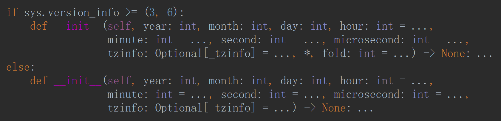
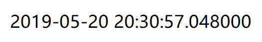
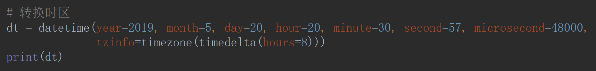

# Datetime

- `datetime.date`——表示日期的类

- `datetime.time`——表示时间的类

- `datetime.now()`——返回当前日期和时间

- `datetime(【date】)`——Struck time→Format string，构建指定日期和时间

- `datatime(strptime(【str】,【'%Y-%m-%d %H:%M:%S'】))`——Str→Format string——用户输入的日期和时间是字符串，要处理日期和时间，首先必须把 str 转换为 datetime

- `datetime.strftime(【datetime】,【'%Y-%m-%d %H:%M:%S'】)`——Format string→Str——要把它格式化为字符串显示给用户，就需要转换为 str

- `【datetime】.timestamp()`——Strucktime→Timestamp，timestamp是一个浮点数。如果有小数位，小数位表示毫秒数

- `datetime.fromtimestamp(【date】)`——Timestamp→Struck time

- `timedelta()`——时间差

- `tzinfo=timezone(timedelta())`——转换时区

