# Time

<ul>
    <li><a href='datetime'>datetime</a></li>
</ul>

### time.sleep()

休眠

### time.time()

时间戳，返回的是**float**类型

### time.ctime(Timestamp)

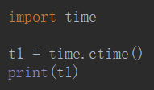

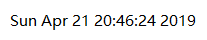

## 表示时间的三种方式

| 表示           | 形式           | 用途         |
| -------------- | -------------- | ------------ |
| 字符串         | **格式化**时间 | 给人看       |
| 时间戳         | float          | 给计算机看   |
| **结构化**时间 | 元组           | 计算时间用的 |

### struct_time

| 索引(Index) | 属性(Attribute)  | 值(value) |
| ----------- | ---------------- | --------- |
| 0           | tm_year          |           |
| 1           | tm_mon           |           |
| 2           | tm_mday          |           |
| 3           | tm_hour          |           |
| 4           | tm_min           |           |
| 5           | tm_sec           |           |
| 6           | tm_wday(weekday) |           |

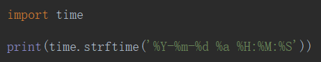

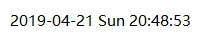

## 格式之间的转换

- Struck time $\rightleftharpoons$ 结构化时间

- Timestamp $\rightleftharpoons$ 时间戳

- Format string $\rightleftharpoons$ 格式化时间

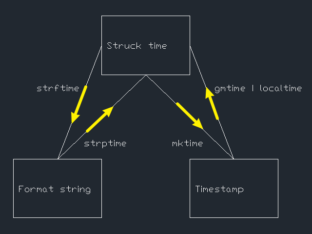

### 时间戳 $\rightarrow$ 结构化时间 localtime() / gmtime()

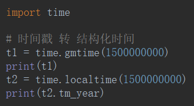

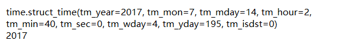

### 结构化时间 $\rightarrow$ 时间戳 mktime()

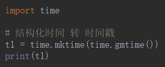

### 结构化时间 $\rightarrow$ 格式化时间 strftime()

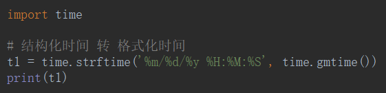

### 格式化时间 $\rightarrow$ 结构化时间 strptime()

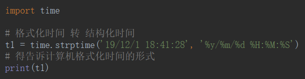

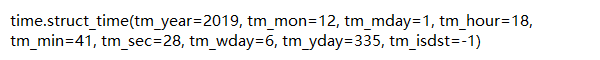

## 时间差

