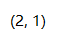
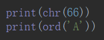

# 内置函数

## 作用域

`locals()`——获取本地局部空间的变量的字典

`globals()`——以字典类型返回当前位置的全部全局变量

## 帮助

`dir()`——查看一个对象所拥有的方法

`help()`——帮助文档

## 调用

`callable()`——检测函数能否被调用

## 模块

`import()`

`.__import__()`

## 内存

`id()`——内存地址

`hash()`——获取取一个对象（字符串或者数值等）的哈希值

## 输入输出

`input()`——函数接受一个标准输入数据，返回为 string 类型

`print()`——打印输出

- file 

默认是输出到屏幕，如果设置为文件句柄，输出到文件

- sep 

打印多个值之间的分隔符，默认为空格

- end

每一次打印的结尾，默认为换行符

- flush

立即把内容输出到流文件，不做缓存

## 字符串类型代码的执行

`exec()`——没有返回值，适合简单的流程控制

`eval()`——适合处理有结果的简单计算，**只能用在你明确知道要执行的代码是什么**

complie()——将一个字符串编译为字节代码

## 数字

### 数据类型

`bool()`——布尔

`int()`——整型

`float()`——浮点型

`complex()`——实数 + 虚数(j) = 复合的数 = 复数

### 进制转换

`bin()`——十进制 转 二进制

`oct()`——十进制 转 八进制

`hex()`——十进制 转 十六进制

### 数学运算

`abs()`——绝对值

`divmod()`——（除法，取模）

div $\rightleftharpoons$ 除法 mod $\rightleftharpoons$ 取模

`round()`——小数的精确

`pow()`——Equivalent to x\*\*y (with two arguments) or x\*\*y % z (with three arguments)

`sum()`——求和，必须是**可迭代**的类型

`max()`——最大值

`min()`——最小值

## ASCII

`chr()`——当前整数对应的 ASCII 字符

`ord() `——当前 ASCII 字符对应的整数

## 数据结构

`reverse()`——反转，改变原来列表

`reversed()`——不改变原列表，返回一个迭代器

`sorted()`——排序，**返回一个列表**

`bytes.decode()`——以指定的编码格式**解码** bytes 对象

`str.encode()`——以指定的编码格式**编码**字符串

`memoryview()`——返回给定参数的内存查看对象

`repr()`——函数将对象转化为供解释器读取的形式

## 迭代修饰函数

- `enumerate()`——枚举，函数用于将一个可遍历的数据对象(如列表、元组或字符串)组合为一个索引序列，同时列出数据和数据下标，一般用在 for 循环当中。

**可以优化循环**——在遍历一个列表的同时获取当前下标。

- `product()`——可以接收多个可迭代对象，然后根据它们的笛卡尔积不断生成结果。

**对于这种需要嵌套遍历多个对象的多层循环代码**

- `islice(【iterable,start,end,step】)`——可更改循环的步长，起始，结束

## 判断真假

- `all()`——判断是否有假，对象必须是**可迭代**的

- `any()`——判断是否有真，对象必须是**可迭代**的

## 高级

- `zip()`——拉链

- `filter()`——过滤，**跟列表推导式一样**

- `map()`——

| filter                             | map                  |
| ---------------------------------- | -------------------- |
| 执行之后结果集合 <= 执行之前的个数 | 执行前后元素个数不变 |
| 只管筛选，不会改变原来的值         | 值可能发生改变     |
