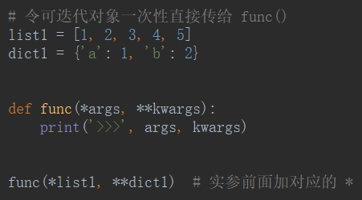

# 动态参数

可以传**任意**个实参

## *args

按**位置**传参，组织成一个**元组**

## **kwargs

按**关键字**传参，组织成一个**字典**

## 传参顺序

带`*`的都在对应类型参数的后面

## 动态参数的另外一种传参方式——令可迭代对象一次性直接传给 func()

- 实参：给一个**序列**加上`*`或`**`，就是将这个序列**按照顺序打散**。

- 形参：给一个**变量**加上`*`或`**`，就是组合所有传来的**值组合**。

