# 命名空间和作用域

## 内置的命名空间

存在**python解释器**里的一启动就可以用。例如`print`

## 全局命名空间

程序从上到下被执行的过程中依次加载进内存

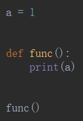

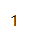

## 局部命名空间

- 函数内部的名字

- 不是在**定义**函数的时候生成的，而是**调用**函数时生成的，随着函数执行的**结束**，这个命名空间就**回收**了。

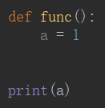

**变量随着函数执行完毕都消失了**

## 找名字的优先级

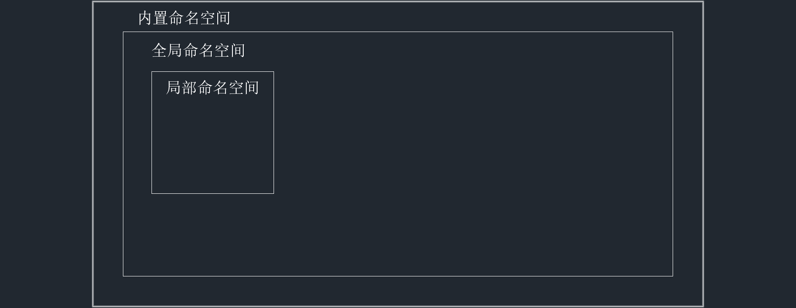

定义了同名的函数时，**局部 > 全局 > 内置**。

### 全局里有用，不用内置的

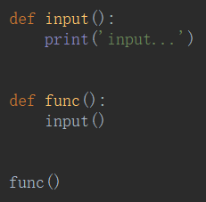

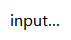

### 局部里有用，不用全局的

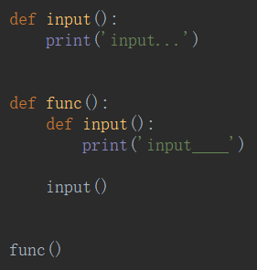

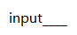

### 局部命名空间的变量不互相共享

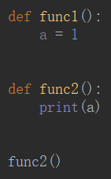

## 全局作用域

**内置命名空间、全局命名空间**∈

## 局部作用域

**局部命名空间∈**

## global

- 对于**不可变数据类型**，在局部作用域可**查看**全局作用域的变量，但不能直接修改。

- 如果想要修改需要加个`global`声明，在局部内的所有操作将对全局都有效。

  

> 可以查看

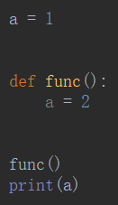

> 不可修改

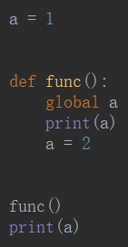

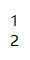

## locals()

`locals()`能看到**本地**的变量名字。

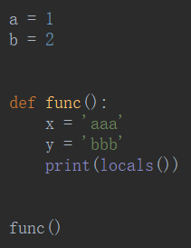

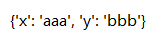

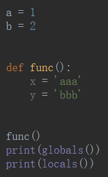

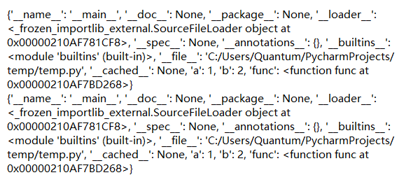

## globals ()

`globals()`只能看到**全局作用域**和**内置作用域**的变量名字。

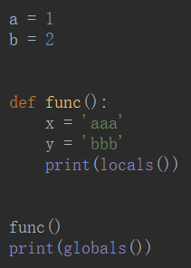

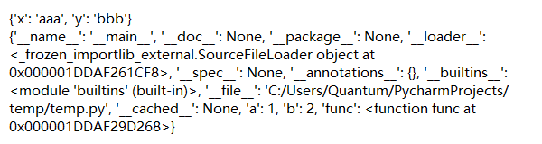

## nonlocal()

`global`只能对全局起作用，`nonlocal`只能对**局部**起作用，找**上层最近**的局部变量

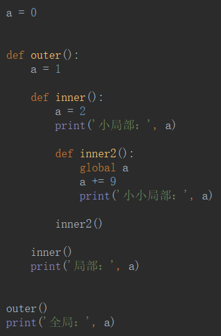

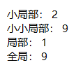

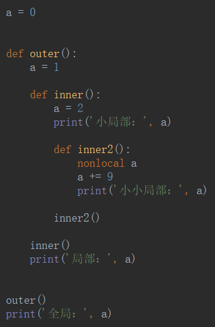

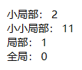

