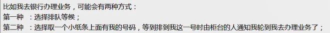

[TOC]

# 并发编程

## 进程

运行当中的程序 *跑起来的*

操作系统动态执行的**基本单元**

### 时间片轮转法 和 多级反馈队列

把程序处理的分为**时间片**，**新来的**程序先执行一个时间片，如果是**长程序**，在一个时间片内没有执行完，就会被推到下一级。

## 并行 VS 并发

<table>
<tr>
<td>并行</td>
<td>并发</td>
</tr>
<tr>
<td>要有多个处理器，同时运行</td>
<td>一个处理器，你运行一会，我运行一会</td>
</tr>
</table>

## 进程三状态转换图

## 同步 VS 异步 & 阻塞 VS 非阻塞色

同步——等候

