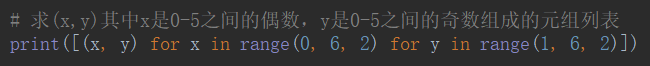

# 推导式

## 列表推导式

- 遍历操作

`[【每一个元素或者是和元素相关的操作】 for i in 【可迭代数据类型】]`

- 双 for 遍历

`[【每一个元素或者是和元素相关的操作】 for i in 【可迭代数据类型】 for ii in i]`

- 筛选操作

`[【满足条件的元素相关的操作】 for i in 【可迭代数据类型】 if 【元素满足相关的条件】]`

### 30以内所有能被3整除的数

### 30以内所有能被3整除的数的平方

### 找嵌套列表中名字含有两个‘e’的所有名字

## 字典推导式

### 将一个字典的key和value对调

### 合并大小写，对应的value值，将key统一成小写

**没有想到用`get()`方法，一直想着做判断，想做筛选，其实直接去找想要的更简便**

## 集合推导式

### 计算列表中每个值的平方，自带去重功能

## 例题

### 过滤掉长度小于3的字符串列表，并将剩下的的转换成大写字母

### 求(x,y)其中x是0-5之间的偶数，y是0-5之间的奇数组成的元组列表

### 求M中3，6，9组成的列表M = [[1,2,3],[4,5,6],[7,8,9]]

