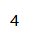
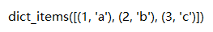

# 数据类型

| 不可变，可哈希 | 特点 | 可变           | 特点         |
| :------------- | ---- | :------------- | ------------ |
| boolean        |      | llist          | 量大         |
| int            |      | dict$_{value}$ | 关系型，映射 |
| str            |      | set            | 科学计算     |
| tuple          | 只读 |                |              |
| dict$_{key}$   |      |                |              |

## Int

`.bit_length()`——转成二进制会有多长*是个属性，不是方法*

## String

### 索引&切片

- [首:尾:步长] ——顾头不顾尾
- 字符串是不变类型，对字符串进行的任何操作都与原来的字符串无关了

### 大小写转换

- `.capitalize()`——**只**首字母大写

- `.upper()`——全大写

- `.lower()`——全小写

- `.swapcase()`——大小写转换

- `.title()`——被特殊字符隔开的单词都大写

<table>
    <tr>
        <td>查</td>
        <td>改</td>   
    </tr>
    <tr>
        <td>find</td>
        <td>strip</td>   
    </tr>
    <tr>
        <td>count</td>
        <td>split</td>   
    </tr>
    <tr>
        <td></td>
        <td>replace</td>   
    </tr>
</table>

### 查

- `.find(【start】,【end】)`——返回找到字符的索引，如果没找到返回 -1，还可以填写开始和结束的范围

- `.count(【start】,【end】)`——统计字符出现的次数

### 改

- `.strip(【char】)`——剥夺指定的字符

- `.split(【maxsplit】)`——分割成 list，有最大分割次数**最多几刀**默认是结束

- `.replace(【count】)`——替换**当然就有新、旧**，有替换计数功能

## List

<table>
    <tr>
    	<td>增</td>
        <td>删</td>
        <td>改</td>
        <td>查</td>
    </tr>
    <tr>
        <td>append</td>
        <td>pop</td>
        <td>索引</td>
        <td>for</td>
    </tr>
    <tr>
        <td>insert</td>
        <td>remove</td>
        <td>切片</td>
        <td>index</td>
    </tr>
    <tr>
    	<td>extend</td>
        <td>clear</td>
        <td></td>
        <td></td>
    </tr>
    <tr>
    	<td>+</td>
        <td>del</td>
        <td></td>
        <td></td>
    </tr>
</table>
### 增

- `.append()`——追加

- `.insert(【索引】)`——根据索引**前插**

- `.extend(【iterable】)`——可迭代的对象遍历后加入

- `+`——合并

### 删

- `.pop(【index】)`——根据索引剔除，有返回值*可填写返回信息*

- `.remove()`——删除第一次出现的值

### 改

- `[]`——切片

### 查

- `len()`

- `count()`

- `index()`——查找索引，没有`find()`

### 排序

- `sort(【key】 【reverse】)`——正序 
	
	- *在原有的基础上改*
	- key——参数排序
	- reverse——倒序开关

#### e.g.

1. 把列表去重，保持原顺序

2. 以年龄排序

- `sort(【reverse=True】)`——倒序

- `reverse()`——反转

- `[::-1]`——

- `join(【iterable】)`——要可迭代对象，返回字符串

## Dict

<table>
    <tr>
    	<td>增</td>
        <td>删</td>
        <td>改</td>
        <td>查</td>
    </tr>
    <tr>
    	<td>[K]=</td>
        <td>pop</td>
        <td>[K]=</td>
        <td>keys</td>
    </tr>
    <tr>
        <td>setdefault</td>
        <td>clear</td>
        <td>update</td>
        <td>values</td>
    </tr>
    <tr>
        <td></td>
        <td>del</td>
        <td></td>
        <td>items</td>
    </tr>
    <tr>
        <td></td>
        <td></td>
        <td></td>
        <td>get</td>
    </tr>
</table>
增 & 改

<table>
    <tr>
    	<td>方法</td>
     	<td>操作数量</td>
       	<td>作用</td>
    </tr>
    <tr>
    	<td>setdefault</td>
     	<td>单</td>
       	<td>没有才添加，有就 pass</td>
    </tr>
    <tr>
        <td>[K]=</td>
    	<td>单</td>
     	<td>没有就加，有就改</td>
    </tr>
    <tr>
        <td>update</td>
    	<td>多</td>
     	<td>更新，有就覆盖，没有就加</td>
    </tr>
</table>

- `.setdefault()`

- `[K]=`

- `.update()`

### 删

- `.pop()`——有返回值，可以知道有没有此键

### 查

<table>
    <tr>
    	<td>方法</td>
     	<td>操作数量</td>
       	<td>作用</td>
    </tr>
    <tr>
    	<td>keys</td>
     	<td>所有键</td>
       	<td>返回键列表</td>
    </tr>
    <tr>
        <td>values</td>
    	<td>所有值</td>
     	<td>返回值列表</td>
    </tr>
    <tr>
        <td>items</td>
    	<td>所有键值</td>
     	<td>返回键值元组列表</td>
    </tr>
    <tr>
        <td>get</td>
    	<td>单键</td>
     	<td>根据键返回值</td>
    </tr>
</table>

- `.keys()`——返回键

- `.values()`——返回值

- `.items()`——返回的是**[( , ), ( , )]**这种列表套元组形式，可以用作循环

### 查

- `.get()`——查找一个特定的key，返回value。如果没有要查找的key，会返回自定义文本，不会报错。

