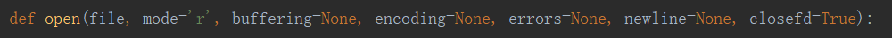
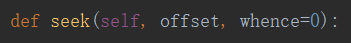

# 文件读写

## 读写文件

- file——必需，文件路径（相对或者绝对路径）

- mode——可选，文件打开模式

- buffering——设置缓冲

- encoding——一般使用utf8

## 读取指针

`seek()`——方法用于移动文件读取指针到指定位置

- offset——开始的偏移量，也就是代表需要移动偏移的字节数
- whence——可选，默认值为 0。给offset参数一个定义，表示要从哪个位置开始偏移；0代表从文件开头开始算起，1代表从当前位置开始算起，2代表从文件末尾算起。

## 文件指针当前位置

`tell()`——方法返回文件的当前位置，即文件指针当前位置

