# RE

- `.findall()`——满足所有匹配的结果放在**列表**中

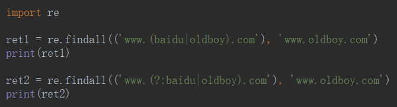

- `.search()`——从前往后，找到一个就返回，返回的变量需要调用

	- `.group()`查看结果，如果没找到就会返回**None**。

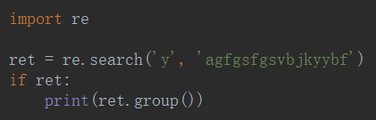

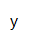

- `.match()`——**开始**如果匹配上了，就跟search()一样，如果没找到就会返回None

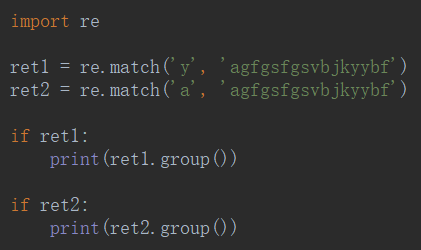

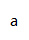

- `.finditer()`——返回形式为迭代器

返回一个存放匹配结果的迭代器

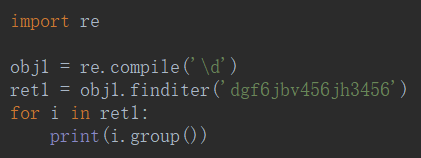

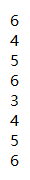

- `.split(【maxsplit】)`——根据正则关系**分割**，依分组形式切，会保留

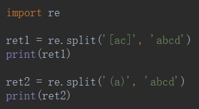

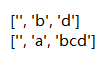

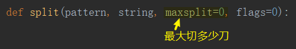

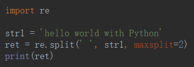

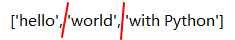

- `.sub()`——根据正则**替换**

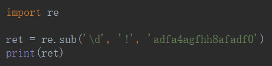

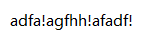

- `.subn()`

返回元组（替换的结果，替换了多少次）

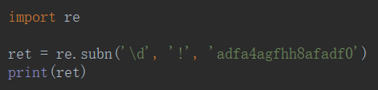

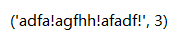

- `.compile()`——将正则表达式编译成一个 正则表达式对象，正则表达式特别长的时候用。

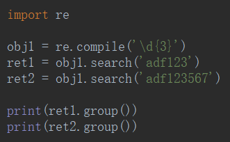

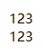

