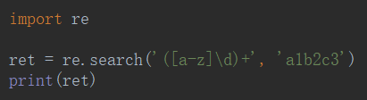
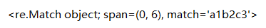
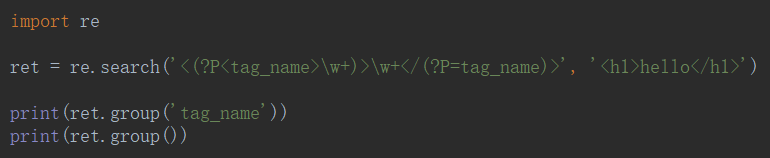
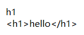
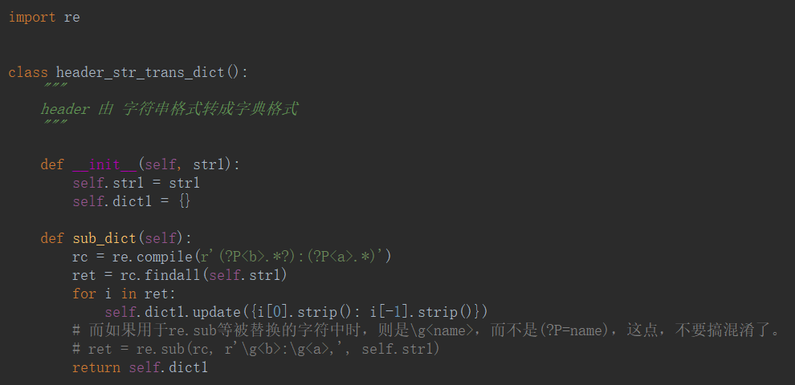

# 分组

## `[ ]`——字符组

在同**一个位置**上可能出现的各种字符组成了一个字符组.

**为什么[A-Z]就可以匹配A到Z的字符——正则是根据ASCII来的**

## ()

### 交替的字符

## (?P\<name>)、(?P=name)

==分组起别名、引用别名为name分组匹配到的字符串。==

1. 首先，使用此(?P=name)之前，在正则表达式中，必须之前已经有了名为name的带命名的group了，即有了类似的(?P<name>)了，才可以用这个(?P=name)去匹配之前的(?P<name>)部分的值。

2. 此(?p=name)只是用来匹配，即只能适用于：re.search，re.match，re.find，re.findall等用来查询，匹配的正则表达式中。**而如果用于re.sub等被替换的字符中时，则是\g<name>，而不是(?P=name)，这点，不要搞混淆了。**

