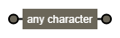
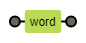
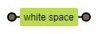
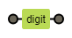
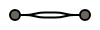
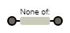
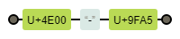

# 常用

- `.`——匹配除`\n`以外的所有字符

- `\w`——匹配变量名

- `\s`——*space*匹配空白符、tab

- `\d`——*digit*匹配数字

- `\W`——匹配！变量名

- `\S`——匹配！空白符

- `\D`——匹配！数字

- `[\W\w]、[\S\s]、[\D\d]`——匹配任意字符 *比`.`好用*

![[Ww]](常用.assets/[Ww].png)

- `|`——or

- `[^ ]`——not

- `\u4e00-\u9fa5`——汉字

