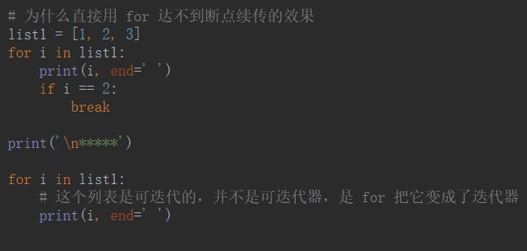
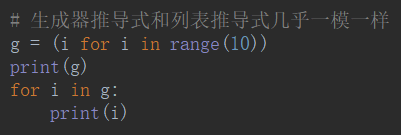

# 生成器

自己写的迭代器

## 生成器函数


### 假如你要产生20000个值


> 生成的数据不必一次全部取完，可以先取一部分，再取一部分。类似断点续传。

### 为什么直接用 for 达不到断点续传的效果




### 监听文件输入

```python
def tail(filename):
    f = open(filename, encoding='utf-8')
    while True:
        line = f.readline()
        if line.strip():
            yield line.strip()


g = tail('file.txt')
for i in g:
    if 'python' in i:
        print('***', i)
```

没做出效果

- `.send()`——和`__next__`效果一样（获取下一个值），只不过获取下一个值的时候，给上一yield的位置传递一个数据


### 预激生成器获取移动平均值


### yield from


## 生成器表达式

### 列表推导式


### 生成器推导式和列表推导式几乎一模一样




返回的值不一样，不占用内存

## 迭代器和生成器的区别

- 迭代器（iterator）是一个实现了迭代器协议的对象，可以通过 for，next 方法进行迭代，在迭代的末尾，会引发 stopIteration 异常。

- 生成器（generator）是通过 yield 语句快速生成迭代器，生成器能做到迭代器能做的所有事，而且因为自动创建了 iter()和 next()方法，简洁，高效的，节省内存。