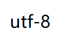

# 编码

## 查看编码

`sys.getdefaultencoding`——当前系统默认编码

## ASCII

- 表示一个字母用 **8 bit = 1 byte**，但是 **7 bite (2$^7$ = 128 种可能)** 已经够用。所以最左边永远是 0，以便后续拓展。
- 1024 byte = 1 kb

## Unicode

- 万国码，适应全球化。一个汉字 2 byte，但中文有 9w 个字，不够用。于是就给了 4 byte，但太浪费了。

## UTF-8

- Unicode 升级版，一个英文 1 byte，其他欧洲字母 2 byte，一个汉字 3 byte。

## py2 与 py3 区别

python2 内部先解码成 unicode 然后编码为 ASCII 保存

python3 内部先解码成 unicode 然后编码为 utf-8 保存