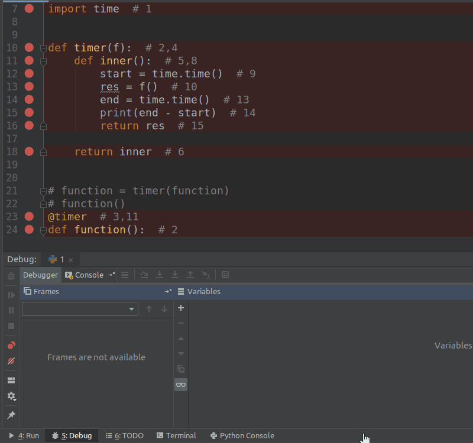

# 装饰器

不想修改函数的调用方式，但是还想在原来的函数前后添加功能。

### 你写了个函数

```python
def function()
	print('Hello World')
```

### 老板要你执行程序的时间

```python
import time


def function():
    start = time.time()
    print('Hello World')
    end = time.time()
    print(end - start)


function()

>>>
Hello World
6.4849853515625e-05
```

### 但你不可能把每个函数都加上时间，再删来删去。于是你写了个时间测试函数把之前的函数当参数导进去。

```python
import time


def function():
    print('Hello World')


def timer(f):
    start = time.time()
    f()
    end = time.time()
    print(end - start)


timer(function)

>>>
Hello World
1.9311904907226562e-05
```

### 假设你写了200多个函数，测试的人员全都要加上timer，也很麻烦。==最好的是还是调用function，但是实际上调用的是timer就完美了。==

```python
import time


def function():
    print('Hello World')


def timer(f):
    def inner():
        start = time.time()
        f()
        end = time.time()
        print(end - start)

    return inner


function = timer(function)  #  function 是原来函数的地址变量，经过一次赋值更改了。
							# 最好的是还是调用function，但是实际上调用的是timer就完美了。
function()

>>>
Hello World
1.7404556274414062e-05
```

## 开放封闭原则

- 对扩展是开放的

- 对修改是封闭的

### 语法糖

```python
import time  # 1


def timer(f):  # 2,4
    def inner():  # 5,8
        start = time.time()  # 9
        res = f()  # 10
        end = time.time()  # 13
        print(end - start)  # 14
        return res  # 15

    return inner  # 6


@timer  # 3,11 function = timer(function)
def function():  # 2
    return 'Hello World'  # 12


res = function()  # 7 Actually use 'inner' instead of 'function'
print(res)  # 16
# every function have return value

>>>
1.1920928955078125e-06
Hello World
```



### 装饰带参数的装饰器

```python
import time


def timer(f):
    def inner(*args, **kwargs):
        start = time.time()
        res = f(*args, **kwargs)
        end = time.time()
        print(end - start)
        return res

    return inner


@timer
def function(a, b):
    print('a = {}, b = {}'.format(a, b))
    return 'Hello World'


res = function(1, b=2)
print(res)

>>>
a = 1, b = 2
1.9311904907226562e-05
Hello World
```

==看着执行的是`function`其实换成了`inner`，∴ 如果给`function`传参，`inner`也要传参==

### 固定格式

```python
def wrapper(func):
    def inner(*args, **kwargs):
        ret = func(*args, **kwargs)
        return ret

    return inner


@wrapper
def function(a, b):
    return 'Hello World'


ret = function(1, b=1)
print(ret)

>>>
Hello World
```

- 拓展例子

```python
def wrapper(func):
    def inner(*args, **kwargs):
        ret = func(*args, **kwargs)
        return ret

    return inner


@wrapper
def function(*a, **b):
    return 'a = {}, b = {}'.format(a, b)


list1 = [2, 3, 4, 5]
dict1 = {'m': 1, 'n': [2, 4, 5]}
ret = function(*list1, **dict1)
print(ret)
```

