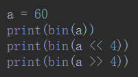
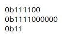

# 位运算符

<table>
    <tr>
		<td>&</td>
        <td>都为一，为一</td>
    </tr>
    <tr>
        <td>|</td>
        <td>有一，就为一</td>
    </tr>
    <tr>
        <td>^</td>
        <td>相异为一</td>
    </tr>
    <tr>
        <td>~</td>
        <td>取反</td>
    </tr>
    <tr>
        <td><<</td>
        <td>各二进位全部左移若干位，高位丢弃，低位补0</td>
    </tr>
    <tr>
        <td>>></td>
        <td>各二进位全部右移若干位，高位丢弃，低位补0</td>
    </tr>
</table>

