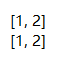

# 迭代器

- 双下方法

- 查看 list 和 range 共有的方法

1. 可迭代——含有`__iter__`的方法就可迭代

- 只有迭代器有的方法

- `.__length_hint__()`——元素个数

- `.__next__()`——可以一个一个的获取值

2. 迭代器——同时含有`__iter__`和`__next__`方法就是迭代器

**用`__next__()`执行了`__iter__()`之后的返回值，就是一个迭代器**

## 迭代器

## for 的含义

1. iterator = l`.__iter__()`：先变成个迭代器

2. iterator`.__next__()`：`i`都是有`__next__`方法取出来的

## range 的含义

**迭代器并不会在内存中再占用一大块内存，而是随着循环 每次生成一个，每次`.__next__()`每次给我一个**

