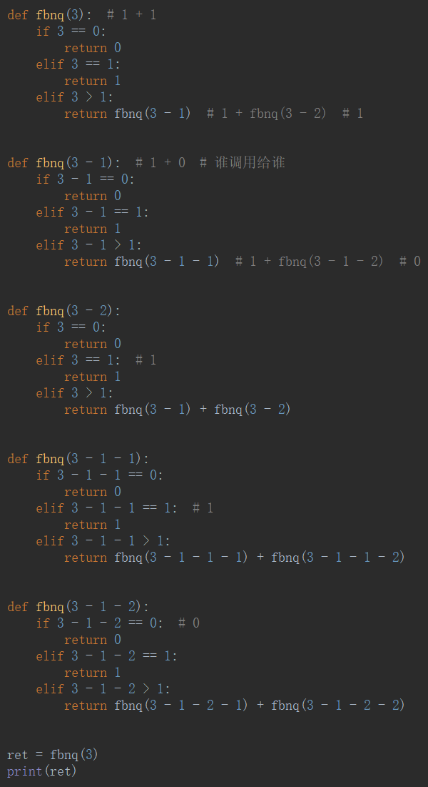

# 递归

在函数中调用自身——**递归就是回溯，return 关系，if 结束就是开始**

- 最大递归深度可以修改

## 例子

### sum

### 斐波那契

- 解释

**跟算法相关的很多跟递归相关**

**递归是从结尾往前推导的算法**

### 单递归实现斐波那契

### 阶乘

 $\rightleftharpoons$ factorial$_ {fakˈtôrēəl}$

